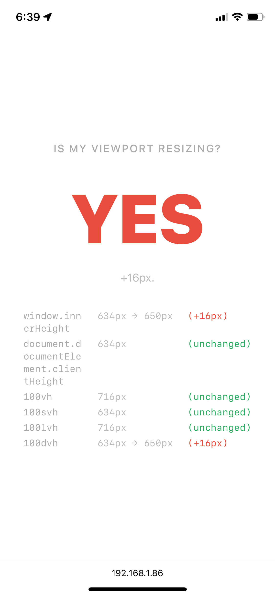
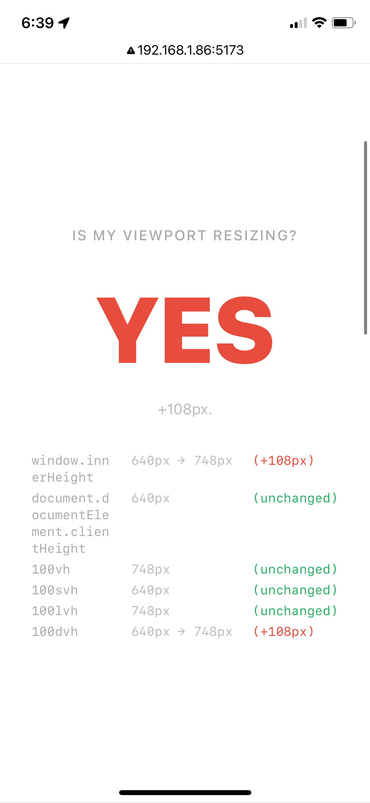
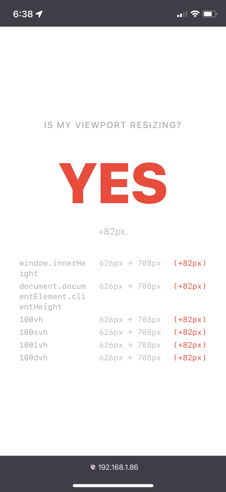

# Is My Viewport Resizing?

Firefox iOS seems (as of March 2026) to cause layouts to jump around more than other browsers when scrolling.

This demo page shows that Firefox iOS resizes the viewport _units_ as well as the viewport, which seems to cause the majority of issues that interrupt the user.

See:

- https://github.com/mozilla-mobile/firefox-ios/issues/22607
- https://github.com/mozilla-mobile/firefox-ios/issues/31109#issuecomment-3628740629
- https://github.com/mozilla-mobile/firefox-ios/issues/26271

Examples where this is very obvious when scrolling:

- https://www.nytimes.com/interactive/2026/01/20/opinion/editorials/trump-wealth-crypto-graft.html
- <video src="images/ScreenRecording_03-20-2026%2019-07-39_1.mp4" controls playsinline muted height="450"></video>

## Results (iOS 18.1, March 20 2026)

| Browser               | Screenshot                                                                                     |
| --------------------- | ---------------------------------------------------------------------------------------------- |
| Safari (iOS 18.1)     |                     |
| Chrome 146.0.7680.151 |  |
| Firefox 148.2         |       |

# Gen AI Disclosure

The code in this repo was majority generated by GenAI.
